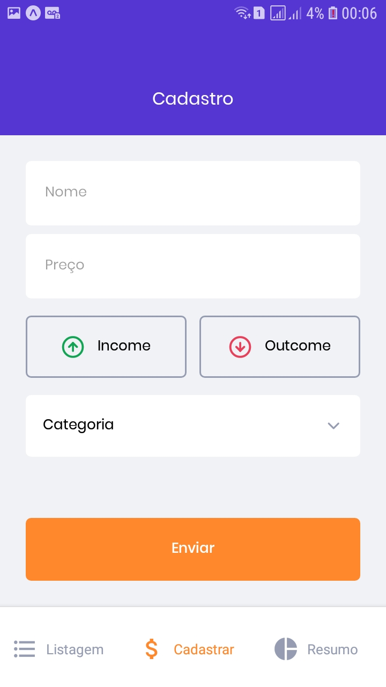
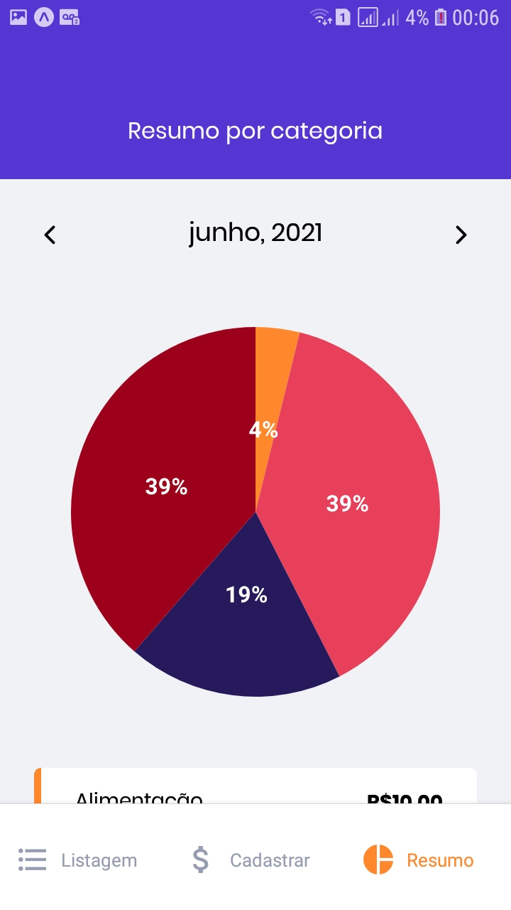

<h1 align="center">
   <br>
</h1>

<br>

<h1 align="center">
  
  
  
  
</h1>

## 💻 Projeto

Aplicação construída no segundo módulo do Ignite (Curso realizado pela [Rocketseat](https://rocketseat.com.br/)) na trilha de React Native.<br>
Este modulo teve como abordagem a ultilização de TypeScript, Formulários, Navegação entre páginas, Ultilização de gráficos, AsyncStorage e a ultilização de login com conta Google e Apple.


## 💬 Funcionalidades
- Login com conta Google ou Apple. (Obs: a opção de login com a conta apple, só será exibida caso esteja em um Iphone);
- Adcionar gastos de acordo com a categoria;
- Exibção dos gastos em gráfico de pizza;
- Navegação dos gastos por mês;


## 🎲 Executar aplicação
```bash
# Clone este repositório
$ git clone https://github.com/WillianMedeiros14/gofinances.git

# Entre na pasta do projeto.
$ cd gofinances

# Instale as dependências
$ yarn

# Execute a aplicação (Android)
$ yarn android

```

## 🚀 Tecnologias ultilizadas

- Este app foi criado com Bare Workflow, o qual possibilita criar aplicações **[React Native](https://reactnative.dev/)**, utilizando tanto as funcionalidades nativas do React Native como também as do **[Expo](https://docs.expo.io)**

